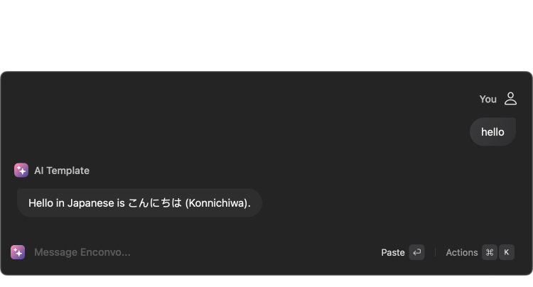

## System Requirements
Before you can create your first extension, make sure you have the following prerequisites.

-  You have Enconvo 1.8.4 or higher installed.

- You have [Node.js](https://nodejs.org/) 18.10 or higher installed. We recommend [nvm](https://github.com/nvm-sh/nvm) to install Node.

- You have npm 7.x or 8.x

- You are familiar with React and TypeScript. Don't worry, you don't need to be an expert. If you need some help with the basics, check out TypeScript's Handbook and React's Getting Started guide.


## Get Started with Your First Extension

Learn how to build your first extension and use it in Enconvo.


Step 1. Clone Extension Template from GitHub:


```bash bash
git clone git@github.com:Enconvo/Extension-Template.git
```

<Note>
 In the template repository, there are the following extension templates.
  - AI Template : Build an extension for interacting with LLM (Large Language Model) based on Langchain JS/TS. 
  - Prompt Template : Build an extension for using Prompt.
</Note>


Step 2. Go to the AI Template directory ( or the other extension directory ) and run the following command:

<CodeGroup>

```bash npm
npm install
```

```bash pnpm
pnpm install
```

```bash yarn
yarn install
```

</CodeGroup>


Step 3. After successful installation then run the following command :

<CodeGroup>

```bash npm
npm run dev
```
</CodeGroup>

<Tip>
Extension will be installed, you can now use it in Enconvo.
</Tip>



